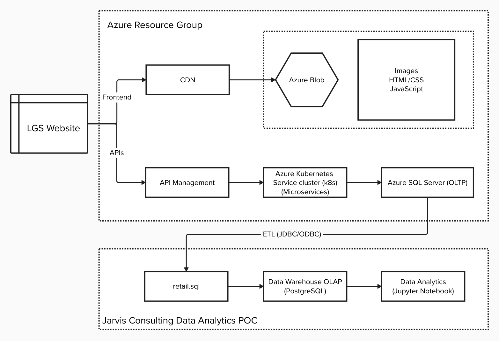

# Introduction

London Gift Shop (LGS) is a UK-based online store that sells giftware.
As a Data Engineer, I was responsible for delivering a **Proof of Concept (PoC)** project to analyze the customer shopping behaviour. The goal of this project is to support the **LGS marketing team** in developing targeted campaigns to attract and retain customers.

The project was implemented using Python, Jupyter Notebook, Numpy and Pandas. I addressed key business questions around **sales performance** and **customer segmentation**, and delivered visuals and insights via Jupyter Notebook and GitHub.

# Implementaion

## Project Architecture

LGS operates a web-based e-commerce system with the following components:

- The **frontend** is hosted on Azure with static assets (HTML/CSS/JS) stored in **Azure Blob Storage**.
- The **backend APIs** runs microservices on an **Azure Kubernetes Service (AKS)** cluster and stores transactional data in an **Azure SQL Server (OLTP)** database.
- This OLTP system supports day-to-day operations like handling purchases and user activity.

To enable analytics without affecting live operational systems:

1. **Transactional data** is extracted from Azure SQL Server via `retail.sql` (ETL process using JDBC/ODBC).
2. The data is then loaded into a **PostgreSQL Data Warehouse** (OLAP), provisioned locally using Docker.
3. Inside this warehouse, we perform **data wrangling and analysis** using **Jupyter Notebook**.

## Data Analytics and Wrangling

- Raw OLAP data is located at `./psql/retail.sql`, with exploratory SQL queries in `./psql/data_explore.sql`.

- Data wrangling and analysis are documented in Jupyter notebook at `./retail_data_analytics_wrangling.ipynb`.

- LGS can gain insights from the provided visualizations and analyses:
  - **Total Invoice Amount Distribution**: This chart shows how purchase amounts are distributed across all orders. This helps identify potential high-spend patterns.
  - **Monthly Placed and Canceled Orders**: This chart tracks trends in placed and canceled orders to detect operational bottlenecks or seasonal patterns.
  - **Monthly Sales & Monthly Sales Growth**: The charts present monthly revenue performance and growth trends. Client can track peak or declining periods for campaign planning.
  - **Monthly Active Users**: The chart indicates how many unique customers make purchases each month.
  - **New and Existing Users**: The chart presents the new user growth acquisition and existing user retention trends.
  - **RFM Segmentation**: Customers are segmented into 10 behavioral groups based on Recency, Frequency, and Monetary metrics. Client can use these segments to tailor marketing campaigns.

# Improvements

- Build a scheduled ETL pipeline to automate data refresh from Azure SQL Server to PostgreSQL, ensuring the analytics stay up to date.
- Conduct in-depth analysis of each product to uncover customer preferences and provide advice for product pricing and bundling strategies.
- Conduct in-depth analysis of each RFM segment to uncover specific buying patterns and support more personalized marketing strategies.
