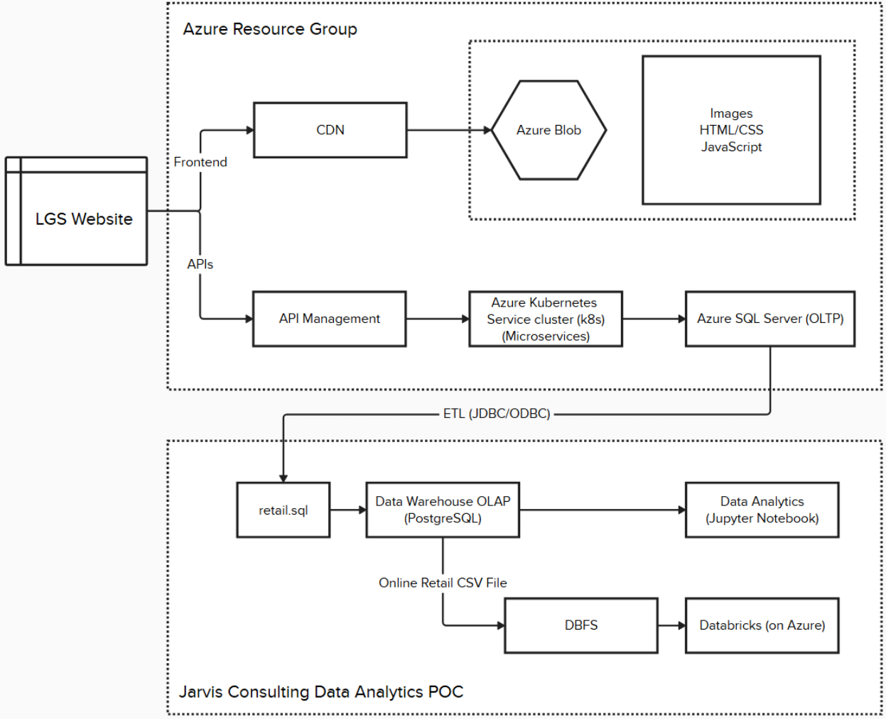
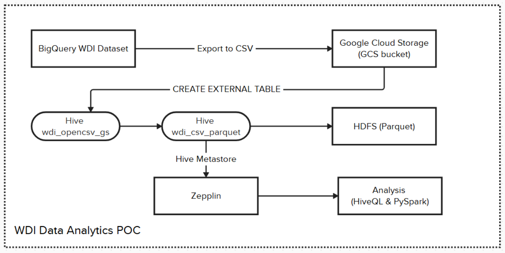

# Spark Project

## Introduction

London Gift Shop (LGS) is a UK-based online store that sells giftware.
As a Data Engineer, I was responsible for delivering a **Proof of Concept (PoC)** project to analyze the data across the company.
The retail dataset was ingested into Azure Storage and the analysis was conducted using Databricks on Aure with PySpark Structured APIs.

## Databricks and Spark Implementation

- The dataset contains transactional records from LGS, including invoices, customers, products, and pricing. We performed data analytics using PySpark DataFrames, including data ingestion, table creation, exploratory analysis, monthly KPIs (sales, cancellations, active users), and RFM-based customer segmentation. [Databricks Notebook](./notebook/Retail%20Data%20Analytics%20with%20PySpark.ipynb)

- We set up a Databricks Workspace on Azure, uploaded the retail dataset to Databricks File System (DBFS), and registered tables using Unity Catalog. A Spark cluster was provisioned to execute analytics using PySpark Structured APIs within Databricks notebooks.
  

## Zeppelin and Hadoop Implementation

- We used HiveQL and PySpark to perform analytics on WDI dataset and visualized the results using Apache Zeppelin Notebook running on a Dataproc Hadoop cluster in Google Cloud Platform (GCP). [Zepplin Notebook](./notebook/WDI%20Data%20Analytics.zpln)

- The WDI dataset was exported from BigQuery to Google Cloud Storage (GCS) in CSV format. We then created an external Hive table `wdi_opencsv_gs` on Dataproc's Hive Metastore, pointing to the CSV files in GCS. After that, we created an internal Hive table `wdi_csv_parquet` in HDFS using Parquet format for optimized storage and query performance. We used HiveQL `%hive` for simple queries and PySpark `%spark.pyspark` for complex analytics.
  

## Future Improvement

- Automate ETL Pipelines with Databricks Workflows
- Integrate BI tools to display results to business users via live dashboards.
- Store data in Azure Data Lake Storage to make the pipeline production-ready.
